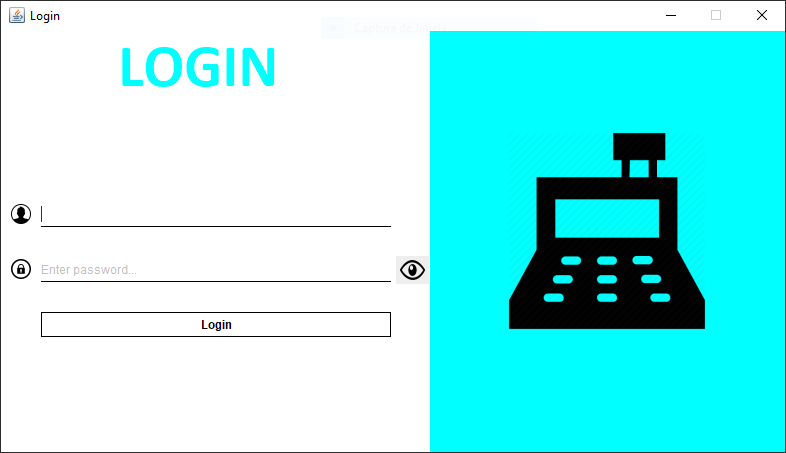
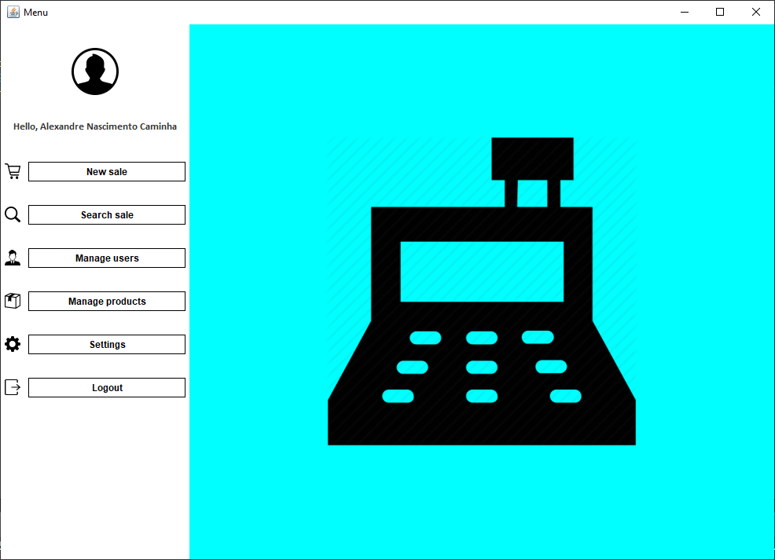
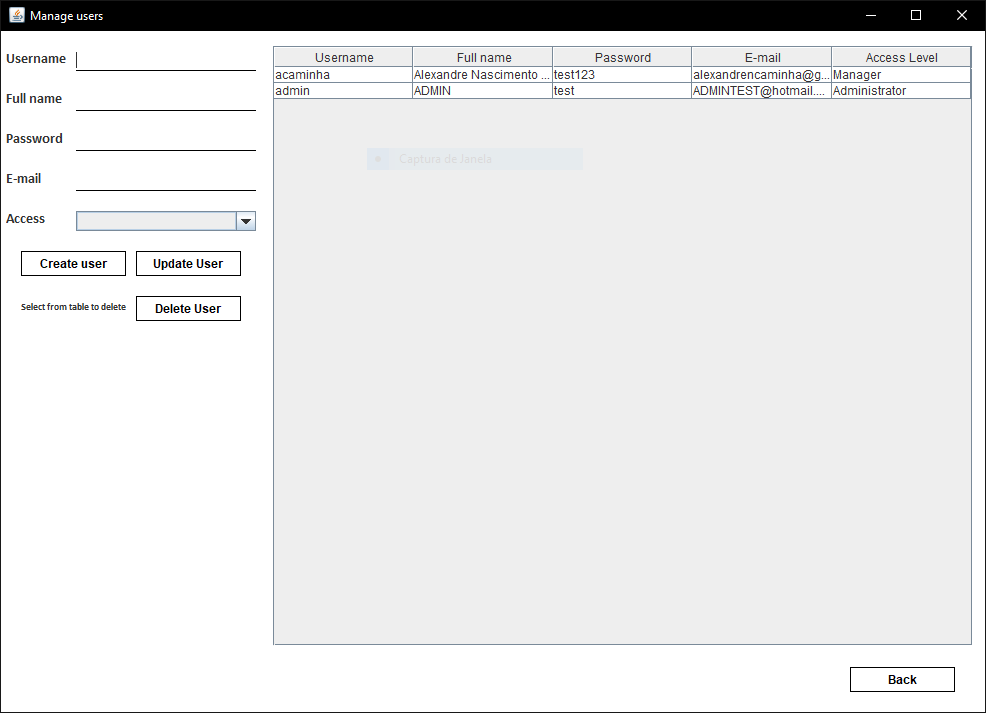
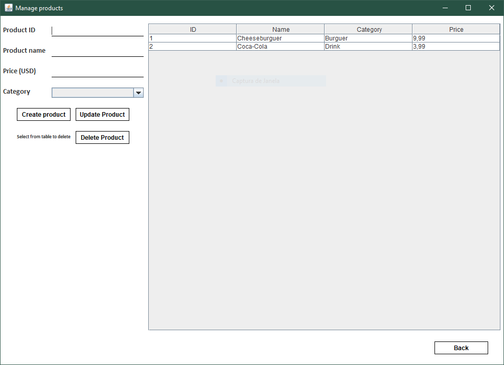
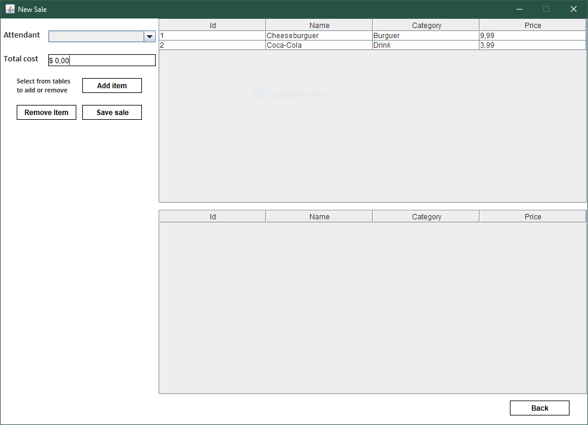

# Java Swing Store Management App
## An application for managing the users and products in a store

---

The aim for this project was for me to have my first experience with Java by using the Swing GUI framework and MySQL database.

The project is still a work in progress:

- [x] Create a GUI base with the Swing library/framework
- [x] Integrate the MySQL database into the project
- [x] Create the login page with authentication
- [x] Create the menu page
- [x] Create the manager's pages
- [x] Create the 'new sale' page
- [ ] Create the 'search sale' page (work in progress)
- [ ] Create settings int the menu for the user to tweak

---

## Screenshots

### Login

### Menu

### Manage users

### Manage products

### New sale
